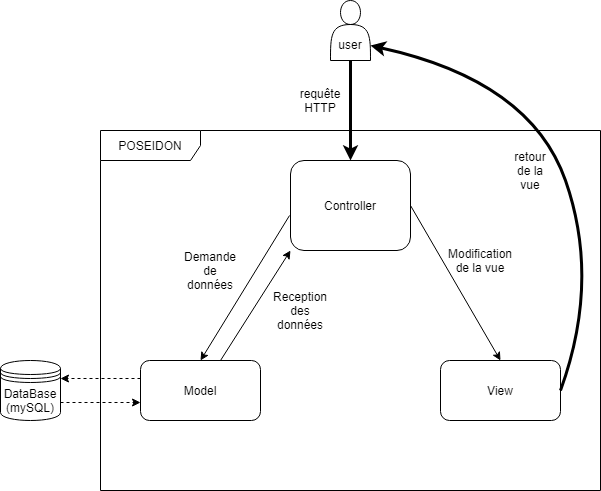

# POSEIDON

- Author: Geoffrey Aulombard - Java web-application developer student at OpenClassRooms
- 
## Description:

- A web application for traders.

## Getting started

- this app runs on port 80, then address is "localhost"
- the mySQL datase runs on port 3306

### Install DataBase
- first, run the script data.sql located in src/main/resources/script
- second, run the script data-test.sql located in src/main/resources/script
- more information in the application.properties file located in src/main/resources

## How it works
### Technologies

This is a Spring Boot Application, working with (check the pom.xml file to see all dependencies and versions)

- Java 11
- Spring Web
- Spring Security
- Spring DATA JPA
- MySQL
- Thymeleaf
- Bootstrap

### Architecture

- this application use the MVC pattern.

### Run the app

use the following command to run the app:
- mvn clean package
- mvn spring-boot: run

use ctrl+c in terminal to stop the program

### Run the tests

use the following command to run the app:
- mvn clean verify